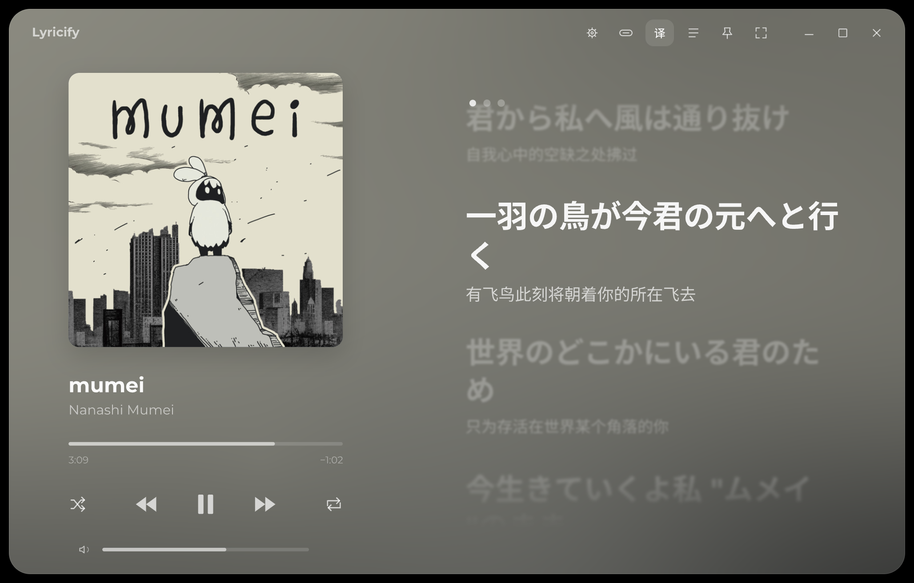

# Lyricify Island

**该项目由 AI 编写**

https://github.com/user-attachments/assets/bc65054e-03d4-4007-9032-1123cf56aa45

Linux 桌面顶置歌词岛。当前曲目和播放进度可来自 Spotify Web API 或本机 MPRIS；逐字歌词与翻译通过
[Lyricify Lyrics Helper](https://github.com/WXRIW/Lyricify-Lyrics-Helper) 获取和解析。
字体、逐字裁剪、双层微光、播放头 bloom 与换行动画都在 Skia 自绘层完成，正常桌面运行时由 GPU 渲染。



## 首次运行

1. 在 [Spotify Developer Dashboard](https://developer.spotify.com/dashboard) 的应用设置中加入回调地址：
   `http://127.0.0.1:43821/callback`。
2. 构建并启动：

   ```bash
   ./build.sh
   ./run.sh
   ```
3. 岛屿提示未配置时，打开托盘菜单的“设置”，填写 Spotify Client ID 和
   Client Secret，然后点击“保存并重新连接”。

也可以在设置中把“播放信息源”切换为“本地 MPRIS”，直接读取本机播放器，无需 Spotify 参数或授权。

Spotify 模式首次授权时会打开浏览器，请登录并允许读取当前播放状态。刷新令牌只保存在当前用户的状态目录，
凭据只保存在当前用户的设置文件中；凭据、令牌、构建缓存和发布目录都不会进入 Git。
发布物 `dist/LyricifyIsland` 是单个可执行文件，自带 .NET 运行时和原生库，启动不要求系统安装 .NET。

Spotify 开发模式下，还需要在 Dashboard 中把登录所用 Spotify 账号加入应用用户列表。
程序启动后常驻系统托盘；托盘菜单提供“打开歌词窗口”“设置”和“退出”。
黑色岛屿区域支持按住左键拖动、左键双击临时隐藏，区域外保持鼠标穿透；
右键菜单也可临时隐藏、调整当前歌曲偏移、水平居中或退出。隐藏时长和拖动行为都可在设置中调整。
右键选择“复制歌曲分享图…”打开预览，选好横竖版和要显示的内容，再点击“复制图片”即可粘贴。
横版宽 2560 像素，竖版宽 2160 像素，高度随内容调整；预览旁会显示复制图片的实际尺寸。
图片保留圆角、阴影和透明留边。粘贴后的透明效果取决于接收应用。

歌词默认选中打开右键菜单时正在播放的那一句，也可以另选或关闭；歌词翻译沿用软件设置。
软件名默认不显示。Spotify 在线歌曲可选择显示二维码，扫码即可打开歌曲；
二维码位于歌曲信息右侧，MPRIS 音源和 Spotify 本地文件不提供二维码。
关闭二维码后，歌曲信息会占满可用宽度；关闭歌词或软件名后，图片会收起多余的空白。

预览窗口始终展示打开时的歌曲，不随播放器切歌。
窗口打开后会重新加载封面，复制时会等待加载完成，并优先使用分辨率较高的版本。
加载失败时会提示使用缓存封面。

## 歌词窗口

点击托盘图标，或在托盘 / 歌词岛右键菜单选择“打开歌词窗口”。也可以用
`./run.sh --lyrics-window` 启动时直接打开。

界面参考 [Lyricify 的 Apple Music Sing 演示](https://www.bilibili.com/video/BV1bK41167Q4/)。
窗口关闭系统标题栏和边框，圆角、阴影、标题栏按钮、封面、播放控件和歌词都由 Skia 绘制。
最大化时去掉窗口圆角、阴影和外侧留边，背景铺满桌面可用区域；全屏时铺满整个屏幕，恢复普通窗口后重新显示圆角。
左侧封面、歌曲信息和播放控件随窗口宽高调整大小，右侧显示滚动歌词；缩小窗口后自动切换为上下布局。
背景从封面取色，切歌时平滑交叉淡化；按钮悬浮、按下、开关和禁用恢复状态也带淡入淡出。
进入和退出纯歌词模式时，封面淡入淡出，歌词区域和播放控件平滑移动，换行变化通过淡化衔接。
歌词逐行弹性滚动，远处的歌词模糊淡出。逐字歌词按真实时间戳渐亮，
长音轻微上浮；只有逐行时间戳的歌词整行点亮。
阴影和可见的静止歌词按屏幕缩放缓存，减少重复模糊与离屏合成；缓存随内容、尺寸或缩放更新，
滚动、逐字高亮和交互动画仍实时绘制，保留原有刷新率和效果。

- 拖动标题栏或封面移动窗口，拖动边缘缩放，双击标题栏切换最大化。
- 滚轮或拖动歌词浏览，停止操作 5 秒后恢复跟随，也可点击“回到当前歌词”。
- 点击歌词跳到对应时间；进度条和音量条支持拖动。
- 播放 / 暂停、上一首、下一首、随机和循环控制当前音源，不支持的操作会变灰。
- 顶栏可切换翻译、纯歌词、灵动岛显示、置顶和全屏，并打开原有设置。
  灵动岛开关会保存，重启后继续生效；翻译与歌词偏移和歌词岛共用。
- 空格播放 / 暂停，左右方向键快退 / 快进 5 秒，上下方向键浏览歌词，Home 恢复跟随，
  T 切换翻译，Ctrl+L 切换纯歌词，F11 切换全屏。Esc 依次退出全屏、恢复跟随或关闭歌词窗口。

关闭歌词窗口后程序仍在托盘运行。MPRIS 直接控制当前选中的本地播放器。
Spotify 播放控制使用官方 API，需要 Premium 与 `user-modify-playback-state` 权限；
旧版本的只读授权在首次点击播放控件时会打开浏览器申请新增权限，单纯显示歌词不触发重新授权。
相关限制见 [Spotify 播放控制文档](https://developer.spotify.com/documentation/web-api/reference/start-a-users-playback)。

## 本地验收

无需 Spotify 即可查看内置的参考动效：

```bash
./run.sh --demo
./run.sh --demo --lyrics-window
./dist/LyricifyIsland --self-test
./dist/LyricifyIsland --snapshot /tmp/lyricify-island.png
./dist/LyricifyIsland --snapshot /tmp/lyricify-lyrics-window.png --lyrics-window
./dist/LyricifyIsland --snapshot /tmp/banner-wide.png --banner
./dist/LyricifyIsland --snapshot /tmp/banner-tall.png --banner --portrait
```

`--demo --exit-after 5` 可用于五秒启动冒烟检查。

## 调整

托盘菜单的“设置”页面提供：

- 整体缩放：50%–200%，默认 100%，同步缩放字体、图标、胶囊、间距和光效。
- 最大宽度：可用屏幕宽度的 40%–100%，默认 70%。
- 背景不透明度：35%–95%；歌词翻译也可以单独关闭。
- 最大刷新率：30–360 FPS，滑杆最右侧为“无限制”，同时应用于歌词窗口和灵动岛，修改后立即生效。
- 垂直同步：可选“无”“垂直同步”“自适应垂直同步”，默认开启普通垂直同步；驱动不支持自适应时回退到普通垂直同步。
  “无限制”只取消额外的帧率上限，垂直同步仍单独生效；实际刷新率也受 GPU、驱动和桌面合成器影响。
  不支持原生交换同步时，开启同步的模式保留显示器刷新率节奏；窗口最小化或灵动岛静止隐藏时减少无效刷新。
- 歌词时间偏移：全局偏移范围为 -2000–2000 毫秒，正值提前、负值延后。
- 每首歌曲偏移：可单独开关；启用后从灵动岛右键菜单调整当前歌曲，并在设置页管理已保存歌曲。
- 歌词源：可选自动、网易云、酷狗或 LRCLIB；也可重新获取当前歌曲。
- 位置与交互：选择显示器、调整顶部距离、记住拖动位置、锁定位置或让整个窗口穿透鼠标。
- 暂停行为：立即隐藏、3 秒后隐藏或保持显示；连接和错误提示不会被隐藏。
- 临时隐藏：可选 2、5、10 或 30 秒。
- 登录后自动启动：写入当前用户的 XDG 自启动目录。
- 播放信息源：可在 Spotify Web API 与本地 MPRIS 之间切换。
- Spotify Client ID 和 Client Secret：点击保存后重新连接，Secret 在界面中遮蔽显示。
- 缓存：显示歌词、封面和歌曲信息缓存占用，并可一键清理。

设置保存在 `$XDG_CONFIG_HOME/lyricify-island/settings.json`；未设置 `XDG_CONFIG_HOME` 时使用
`~/.config/lyricify-island/settings.json`。Linux 下设置目录权限为 `0700`，文件权限为 `0600`。
歌曲缓存保存在 `$XDG_CACHE_HOME/lyricify-island/tracks`；未设置时使用 `~/.cache`。

以下环境变量只用于旧配置迁移：对应字段还没有写入设置文件时才会读取。

- `LYRICIFY_Y=58`：浮层距屏幕顶边的位置。
- `LYRICIFY_OFFSET_MS=0`：歌词同步偏移，正数提前、负数延后。
- `LYRICIFY_CLICK_THROUGH=1`：开启全窗口鼠标穿透；可从设置窗口关闭。

程序在 Linux 上使用 Avalonia 的 X11/XWayland 后端，以便在 GNOME Wayland 会话中可靠定位、置顶和鼠标穿透。
Fedora 缺少运行依赖时可安装：

```bash
sudo dnf install libX11 libXfixes gnome-shell-extension-appindicator \
  google-noto-sans-cjk-fonts julietaula-montserrat-fonts
```

GNOME 还需要启用 AppIndicator 扩展，其他支持 StatusNotifier 的桌面无需额外托盘依赖。

## 歌词回退

自动模式按质量依次尝试：网易云 YRC（逐字 + 翻译）、酷狗 KRC（逐字 + 内嵌翻译）、
网易云 LRC、LRCLIB LRC。指定首选歌词源后会先请求该来源，没有结果再尝试其他来源。
Spotify 未公开歌词 Web API，因此程序不会要求或保存 `sp_dc` 浏览器 Cookie。

上游 Helper 以 Apache-2.0 许可固定为 Git submodule；其许可证保留在
`vendor/Lyricify-Lyrics-Helper/LICENSE`。
